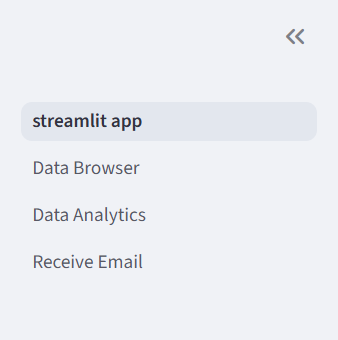

## Development - Run Guides (Windows PowerShell)

Structure:

- Backend (FastAPI): `development/app/main.py`
- Frontend (Streamlit): `development/ui/streamlit_app.py`
- Data (local): `development/data/email_features.json`

Prerequisites (once at project root):

```
pip install -r requirements.txt
$env:OPENAI_API_KEY="<YOUR_API_KEY>"
```

### Run backend and frontend


# Terminal 1 (backend)
uvicorn main:app --host 127.0.0.1 --port 8000 --reload

# Terminal 2 (frontend)
streamlit run streamlit_app.py